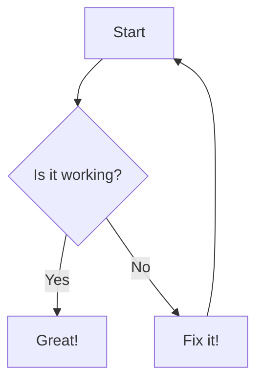

## Features

- Supports **bold** and _italic_ text.
- Includes `inline code` and code blocks.
- Adds Mermaid diagrams for visual representation.
- Contains tables and lists for structured data.

```typescript
private async loadPosts(): Promise<void> {
  console.log('Loading posts from directory:', this.srcDir);
  // 获取所有 Markdown 文件
  const files = fg.sync(`*.md`, {
    ignore: ['**/node_modules/**', '**/public/**'],
    cwd: this.srcDir,
    absolute: true,
    onlyFiles: true
  });

  console.log('files', files);

  for (const file of files) {
    const { data, content } = matter.read(file) as {
      data: Partial<Post>;
      content: string;
    };

    if (!data.excerpt) {
      data.excerpt = await this.extractPlainText(content, 200);
    }
    // 解析文章数据
    const article: Post = {
      title: data.title || '',
      slug: this.generateUniqueSlug(data),
      excerpt: data.excerpt || '',
      coverImage: data.coverImage || '/img/avatar.jpg',
      tags: data.tags || [],
      category: data.category || '未分类',
      publishDate: data.publishDate || new Date().toISOString()
    };
    // slug关联文件路径
    this.postsFilePathRecord[article.slug] = file;

    this.addPostToCategoryRecord(article);

    for (const tag of article.tags) {
      if (!this.postsByTag[tag]) {
        this.postsByTag[tag] = [];
      }
      this.postsByTag[tag].push(article);
    }
    this.posts.push(article);
  }

  // 对文章进行排序，默认按发布日期降序
  this.posts.sort(
    (a, b) => new Date(b.publishDate).getTime() - new Date(a.publishDate).getTime()
  );
}
```

## Mermaid Diagram



## Table Example

| Feature       | Description                    |
| ------------- | ------------------------------ |
| **Bold Text** | Highlights important content.  |
| _Italic Text_ | Emphasizes specific words.     |
| `Code`        | Displays inline code snippets. |
| Diagrams      | Visualizes workflows or ideas. |

## Nested List Example

1. First Level
   - SecondLevel
     - Third Level

## Blockquote Example

> This is a blockquote. Use it to highlight important information or quotes.

## Metadata

- **Title**: Advanced Test Markdown File
- **Tags**: test, markdown, mermaid, advanced
- **Category**: example, testing

## Conclusion

Feel free to modify this file for further testing. It now includes more advanced features like diagrams, tables, and nested lists.

### 测试1

是啊侃大山科技大厦科技的哈萨克接电话奥斯卡奖的哈萨克几乎都是安康就好
啊sd卡金沙店看见按时打卡卡时间段哈萨克接电话

#### 测试2

啊是的快乐就是啊很快就爱上的科技撒谎

- aaa
  - sasdas


